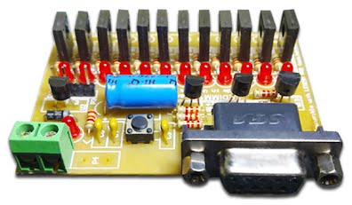

# STM8S based 12 channel pwm with software

### Details
Uses popular stm8s with cosmic c compiles.
below is the website       
https://sites.google.com/site/machledvaydk/cua-cong     

There is a pc software built around visual basic which can able to
program sequences as per user needs.    

